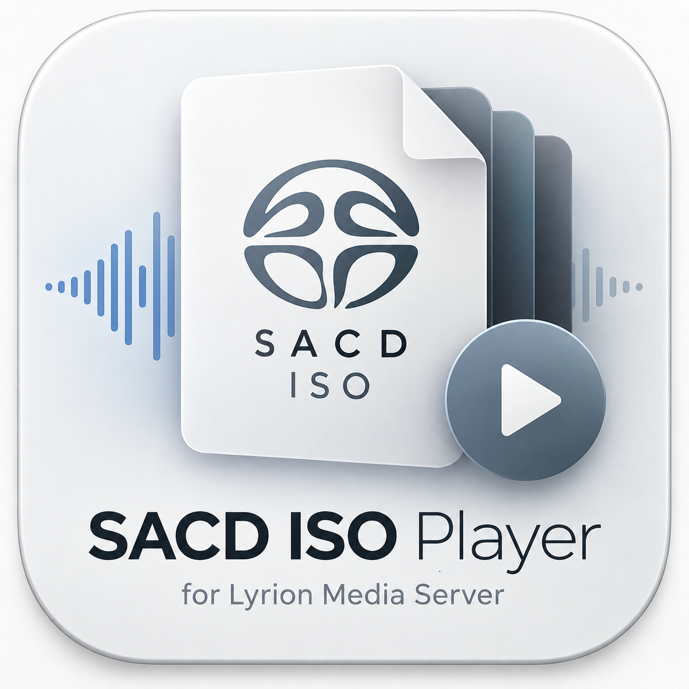

<p align="center"></p>

# SACDPlayer

Plugin para Lyrion Music Server que expõe SACD ISO na biblioteca (área estéreo como álbum; multicanal opcional) e serve DSF extraído por `sacd_extract` a partir de um cache local com evicção LRU, mantendo a passagem nativa `dsf dsf * *` (DoP) do player.

Spec de desenho: `docs/superpowers/specs/2026-09-06-sacdplayer-design.md`.

## O que faz

- Escaneia arquivos `.iso` de SACD colocados na pasta de música e registra a área estéreo como o álbum virtual `<Título> (2ch)`. A área multicanal só vira `<Título> (mch)` com a opção `show_mch` ligada.
- Ao tocar uma faixa virtual (`file://<iso>#<area>-NN`), extrai sob demanda a área inteira (todas as faixas) para DSF via `sacd_extract`, armazena em um cache local com limite configurável (LRU) e serve o arquivo já extraído ao player. Passagem nativa DoP (`dsf dsf * *`) é preservada — nada de transcodificação.
- Multicanal: o engine Apple Squeezer só aceita DSD de 2 canais (`unsupported DSD format: channels=5`), por isso as áreas mch ficam ocultas por padrão. Ligar `show_mch` exige um rescan completo e um player que toque DSD 5/6 canais.
- A primeira reprodução de um álbum espera a extração terminar (mostra "Preparing SACD track N / M" no player); tocadas seguintes do mesmo álbum são imediatas enquanto o cache não for evictado.
- Um único worker de extração por vez; pedidos adicionais entram em fila.

## Instalação

1. Compile o binário `sacd_extract` para o host de destino:
   ```bash
   tools/build-sacd-extract.sh
   ```
   Isso produz `Bin/darwin/sacd_extract` (gitignored — específico da arquitetura do servidor).

2. Publique o plugin no servidor LMS via rsync:
   ```bash
   tools/deploy.sh
   ```
   Por padrão usa `SACD_HOST=musicplayer@10.73.254.20`; sobrescreva com a variável de ambiente se necessário. O script copia `install.xml`, `custom-types.conf`, `strings.txt`, os módulos `.pm`, `Bin/darwin/sacd_extract` e `HTML/` para `~/Library/Application Support/Squeezebox/Plugins/SACDPlayer` no host (pasta de plugins manuais; `InstalledPlugins` é apagada pelo gerenciador de extensões no restart), ajusta permissões (755 dirs / 644 arquivos, 755 no binário) e **não reinicia o LMS**.

3. Reinicie o Lyrion Music Server manualmente (o deploy script apenas lembra):
   ```bash
   open -a "Lyrion Music Server"
   ```
   (após encerrar a instância anterior).

4. Dispare um rescan para o Importer registrar os ISOs:
   ```bash
   curl -s -X POST -H 'Content-Type: application/json' \
     http://<host>:9000/jsonrpc.js \
     -d '{"id":1,"method":"slim.request","params":["",["rescan"]]}'
   ```

## Configurações (Settings → SACDPlayer)

| Campo | Descrição |
|---|---|
| `cache_dir` | Diretório local onde os DSF extraídos são armazenados. |
| `cache_cap_gb` | Limite do cache em GB; acima disso, álbuns mais antigos (LRU) são evictados. |
| `extract_timeout_s` | Timeout de extração por área, em segundos. |
| `min_free_gb` | Piso de espaço livre em disco; extração pausa se ficar abaixo disso. |

A página de settings também lista os álbuns em cache com botões **Prepare** / **Evict** por álbum.

## Verbos JSON-RPC

Todos sob o comando `sacdplayer` (`Slim::Control::Request`), endpoint `http://<host>:9000/jsonrpc.js`.

### `cachestats` — uso do cache, fila e estado do worker
```bash
curl -s -X POST -H 'Content-Type: application/json' http://10.73.254.20:9000/jsonrpc.js \
  -d '{"id":1,"method":"slim.request","params":["",["sacdplayer","cachestats"]]}'
```
Retorna `usage_bytes`, `cap_bytes`, `free_bytes`, `binary` (1 se `sacd_extract` presente), `busy`, `queued`, `low_disk` e a lista `albums` (key/area/bytes/last_access/iso/title).

### `status <key>/<area>` — estado das faixas de um álbum
```bash
curl -s -X POST -H 'Content-Type: application/json' http://10.73.254.20:9000/jsonrpc.js \
  -d '{"id":1,"method":"slim.request","params":["",["sacdplayer","status","abcdef0123456789/2ch"]]}'
```
Aceita também a URL da faixa virtual (`file:///Volumes/.../Album.iso#2ch-01`) no lugar de `<key>/<area>`, por exemplo:
```bash
curl -s -X POST -H 'Content-Type: application/json' http://10.73.254.20:9000/jsonrpc.js \\
  -d '{"id":1,"method":"slim.request","params":["",["sacdplayer","status","file:///Volumes/Disk8TB/Musik/Lossless/SACD-ISO/Album.iso#2ch-01"]]}'
``` Retorna `key`, `area`, `title` e a lista `tracks` (number/state/bytes/error).

### `prepare <key>/<area>` — força extração antecipada do álbum inteiro
```bash
curl -s -X POST -H 'Content-Type: application/json' http://10.73.254.20:9000/jsonrpc.js \
  -d '{"id":1,"method":"slim.request","params":["",["sacdplayer","prepare","abcdef0123456789/2ch"]]}'
```
Falha com `error: sacd_extract missing` se o binário não estiver instalado.

### `evict <key>/<area>` — remove a área do cache e cancela extração em andamento
```bash
curl -s -X POST -H 'Content-Type: application/json' http://10.73.254.20:9000/jsonrpc.js \
  -d '{"id":1,"method":"slim.request","params":["",["sacdplayer","evict","abcdef0123456789/2ch"]]}'
```
Após o evict, `status` para essa área retorna faixas `absent`.

## Limitações conhecidas

- **Multicanal não toca no Apple Squeezer** — o engine recusa DSD com mais de 2 canais; a área `mch` fica oculta salvo `show_mch`.
- **Primeira reprodução espera a extração** — o player mostra "Preparing SACD track N / M" até o `sacd_extract` terminar a área inteira; faixas subsequentes do mesmo álbum são instantâneas enquanto o cache existir.
- **Um único worker de extração** — pedidos concorrentes (outro álbum, ou `prepare` manual) entram em fila; não há paralelismo.
- **Sem retry automático** — se a extração falhar (binário ausente, exit não-zero, timeout, disco baixo), a faixa fica marcada `failed` e uma nova tentativa exige um novo pedido de reprodução ou `prepare`.

## Licença

GPL-3.0 (ver `LICENSE`). O binário `sacd_extract` embarcado vem do fork Sound-Linux-More/sacd-extract (GPL-2) e é executado como processo separado.
